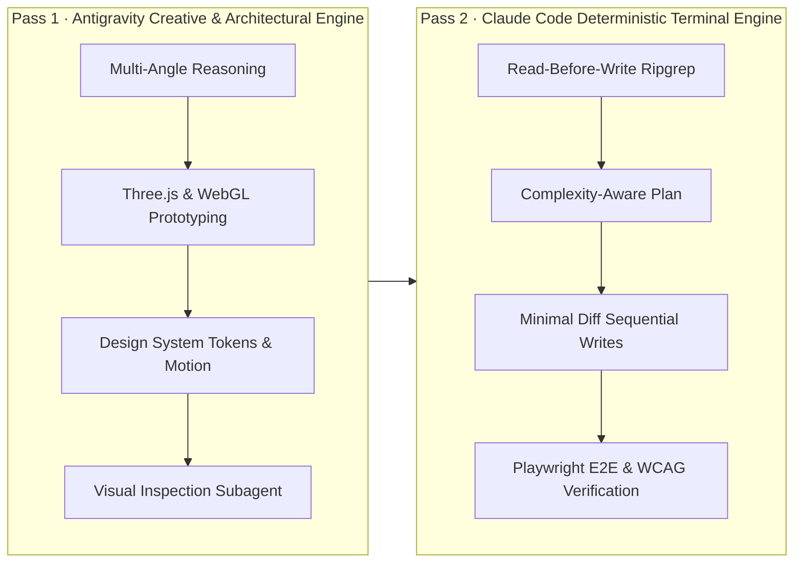

# Portfolio Architecture & AI-Engineered Environment

This document records the architectural specifications, interaction mechanics, and AI environment design governing this portfolio.

---

## 1. Dual-Engine Workflow

The engineering of this portfolio is governed by a **Two-Pass Dual-Engine Strategy**:

### Governing Custom Skills
1. **`design-taste-frontend`**: Anti-generic-frontend taste skill enforcing curated single-accent palettes, disciplined typography hierarchies, and zero redundant CTAs.
2. **`emil-design-eng`**: Physics-driven motion, micro-interactions, layout transitions, and perceived performance.
3. **`impeccable`**: Design critique, accessibility audits, and precision polish.
4. **`claude-workflow`**: Explore → Plan → Implement → Verify methodology adapted for autonomous agents.
5. **`continuous-agent-loop` & `loop-design-check`**: Bounded execution loops with 5-iteration limits, test-driven backpressure, and anti-gaming circuit breakers.

---

## 2. 3D WebGL Sentinel Mechanics (`Robot.tsx` + `CosmosScene.tsx`)

- **Neck Pivot Group**: The head, visor sensor panel, eyes, antenna, and side pods are anchored in a dedicated pivot group at `[0, 0.35, 0]`.
- **Head Gaze Math**:
  - Yaw: $\theta_y = \text{clamp}(p_x, -1, 1) \times 0.26 \text{ rad} \approx \pm 15^\circ$
  - Pitch: $\theta_x = -\text{clamp}(p_y, -1, 1) \times 0.14 \text{ rad} \approx \mp 8^\circ$
  - Damped via exponential frame-rate independent interpolation: $\Delta_{\text{lerp}} = 1 - e^{-\text{delta} \times 6}$
- **Radial Socket Clamping**:
  $$\text{dist} = \sqrt{\text{gazeX}^2 + \text{gazeY}^2}$$
  $$\text{scale} = \begin{cases} \frac{0.028}{\text{dist}} & \text{if } \text{dist} > 0.028 \\ 1 & \text{otherwise} \end{cases}$$
  This strictly prevents pupils from escaping their sockets regardless of viewport aspect ratio.
- **Organic Micro-Behaviors**:
  - Blinking reflex: 110ms sine pinch every 4.2s.
  - Idle scanning: Lissajous curve navigation when idle for $>2.4$s.
  - Reduced-motion compliance: Hard freezes gaze and camera when `prefers-reduced-motion: reduce`.

---

## 3. Automated Verification

- **Playwright Suite**: `tests/portfolio.spec.ts` (9/9 passing, exit code 0)
- **Production Build**: Next.js 16 App Router + Turbopack + TypeScript (exit code 0)
- **Accessibility**: WCAG 2.1 AA contrast compliance across all text nodes and buttons.
